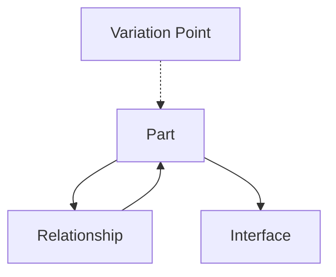
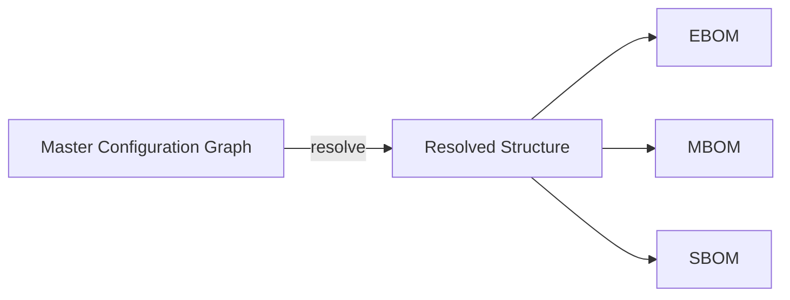

# Next Generation PLM vs Single BOM Dataset (2011)

> *A product is not defined by enumeration, but by constraint evaluation.*


## 1. Introduction

### Design Philosophy Context

The practical implication of this design perspective is that product structure is not authored directly as a static hierarchy. Instead, it emerges from the interaction between technical features, interfaces, and variation rules within a shared configuration model.

This document examines the commonly presented idea of "Next Generation PLM" and places it in the historical context of a real-world implementation that predates the contemporary narrative by more than a decade. In 2011, the Single BOM Dataset approach was implemented in a production automotive program with full lifecycle implications across engineering, manufacturing, and service. While the industry today often frames configuration-driven product structures as an emerging direction, the core principles have already been validated in practice.

Our intention is not to claim authorship or ownership of this approach. The original conceptual framework and implementation methodology were developed by experienced PLM architects and solution experts. We were responsible for understanding, applying, and operationalizing these principles in an enterprise environment. By reviewing both the prior implementation and the current industry narrative, we aim to clarify the essential structural model behind configuration-driven product lifecycle management.

## 2. The "Next Generation PLM" Narrative

In recent years, the term "Next Generation PLM" has been used to describe a shift from document- and file-driven lifecycle management toward configuration-driven, model-based product structures. This narrative highlights several goals that are both reasonable and relevant:

- Supporting concurrent engineering rather than sequential hand-offs
- Using a unified product structure that can be configured rather than cloned
- Maintaining continuity of product definition from engineering to manufacturing to service
- Reducing interpretation gaps by improving structural and visual consistency across domains

These themes reflect a broader industry recognition that traditional PLM systems, when implemented as isolated repositories or disconnected process workflows, struggle to support increasing product variability and compressed development cycles.

However, it is important to note that this narrative remains primarily conceptual in many organizations. While the direction is clear, the underlying structural transformation—from static BOM hierarchies to a configuration-resolvable product graph—requires a modeling foundation that is not always explicitly defined in these discussions.

As a result, "Next Generation PLM" is often described in terms of benefits, outcomes, and collaboration patterns, rather than in terms of the structural model required to support them. The ideas are sound; the question is whether the industry has access to a proven model capable of realizing them.

## 3. What We Achieved in 2011: Single BOM Dataset

### Scope of the Program
The solution was delivered through three coordinated sub‑projects:

- **PDM Core** — Establishing controlled part definitions, attributes, lifecycle states, and change governance.
- **BOM Solution** — Implementing the unified configuration‑resolvable product structure and lifecycle projections.
- **Sourcing & Procurement Alignment** — Ensuring that supplier, cost, and sourcing alternative decisions were consistent with technical feature‑driven configuration contexts.

In addition, a **Service‑focused component** was deployed to support after‑sales operations, commonly referenced at the time as the *Electrical/Equipment/Part Catalog* (EPC). Its purpose was to expose the resolved service‑relevant Bill of Materials for 4S service centers, including spare parts, replacements, and repair applicability. This component was implemented using the out‑of‑the‑box Library Central framework, extended with a full‑text search indexing layer to support practical retrieval and identification workflows for service technicians.

Because the EPC view is itself a filtered projection of the resolved configuration, it did not require a separate authored dataset. It remained structurally consistent with the engineering definition while presenting only the service‑relevant perspective.

These initiatives were not separate systems—they operated on the same unified product definition, ensuring that engineering, manufacturing, sourcing, and service all derived their views from the same structural basis.

The 2011 implementation did not introduce new terminology or claim to redefine PLM. Instead, it validated a structural approach that differs fundamentally from traditional BOM management. Rather than maintaining separate Engineering, Manufacturing, and Service BOMs as independently authored structures, a single configuration-resolvable product definition served as the shared source of truth across lifecycle domains.

This approach relied on three essential principles:

1. **A unified product structure model** — The product was represented as a single graph consisting of parts, relationships, interfaces, and variation points, rather than multiple cloned hierarchies.
2. **A separation of expression and decision layers** — Marketing-facing feature descriptions (used for planning and communication) were mapped to technical features that directly governed structural resolution.
3. **Configuration-based projection rather than duplication** — Lifecycle views such as EBOM, MBOM, and SBOM were not stored as independent datasets. They were generated on demand by applying feature- and rule-based resolution to the unified structure.

By validating that these principles could operate at full vehicle scale—with real program timelines, variant complexity, supply chain interaction, and manufacturing constraints—the implementation demonstrated that configuration-driven structures were not only theoretically sound, but also executable in practice.

The success of the system was not defined by tooling alone. It depended on organizational alignment, consistent modeling practices, and the ability to maintain technical feature definitions and rule sets with clarity and discipline. The project showed that when these factors are present, a Single BOM Dataset can support full lifecycle operations in a real production context.

## 4. Why It Was Next Generation Before It Had a Name

The 2011 implementation occurred under a particular set of conditions that are not commonly present at full enterprise scale. These conditions were not incidental; they were structural, and they made it possible to apply a configuration‑driven product definition model without fragmentation.

Several enabling factors aligned simultaneously:

- **Minimal legacy constraints** — The program operated without the burden of deeply entrenched, cloned BOM practices or incompatible historical data structures.
- **A unified platform architecture perspective** — Product development was driven by shared architectural decisions rather than isolated subsystem ownership.
- **Cross‑functional agreement on product structure ownership** — Engineering, manufacturing, and service organizations recognized the value of a shared structural model rather than maintaining separate interpretations.
- **Executive support for configuration‑driven methods** — Leadership endorsed the principle that product variation should be resolved through feature and rule evaluation rather than structural duplication.
- **Access to experienced configuration and PLM methodology experts** — The implementation relied on individuals with practical understanding of feature modeling, structural decomposition, and lifecycle impacts.

These conditions parallel the organizational characteristics often associated with successful large‑scale systems transformation (e.g., the SPACE model for socio‑technical alignment). None of these factors alone would have enabled the outcome; it was the convergence of organizational readiness, architectural clarity, and methodological discipline that made the Single BOM Dataset viable in practice.

This is why the solution can appear to anticipate current "Next Generation PLM" discussions. The foundational ideas were not new; the environment simply allowed them to be realized.

## 5. Why the Industry Still Calls This "Next Generation"

Although configuration‑driven product structures have been demonstrated in practice, most enterprise PLM environments continue to rely on hierarchical BOM representations as the primary data model. These hierarchies are well‑suited for display, review, and communication, but they are limited in their ability to express variation, reuse, and structural dependencies.

### 5.1 The Persistence of Tree‑Structured BOM Models

Traditional BOM hierarchies assume that the product can be represented as a single, fixed decomposition from whole to parts. When variation is introduced, organizations typically clone or branch structures to represent different configurations. While familiar, this method increases maintenance overhead and introduces divergence between lifecycle views.

### 5.2 Difficulty Representing Variation in a Hierarchical Model

Product variation is not inherently hierarchical. Interchangeability, reuse, optional content, and interface compatibility form a network of relationships that is more accurately expressed as a graph. Hierarchical BOMs do not naturally capture these dependencies, forcing organizations to encode variation through exceptions, naming conventions, or duplication.

### 5.3 Lack of a Structural Resolution Mechanism

In many PLM implementations, configuration selection is performed outside the product structure model. Rules, feature expressions, and configuration decisions are stored as annotations rather than mechanisms that actively shape the structure. Without an integrated resolution model, systems cannot reliably derive lifecycle views from a single definition.

### 5.4 Consequence: The Model Exists, but Not the Means to Operate It

Because the hierarchical BOM remains the operational form while configuration logic remains external or informal, the underlying capability appears conceptually forward‑looking—even when it has already been proven. The gap is not in conceptual understanding but in the structural data model and resolution mechanism required to make the concept executable.

In this sense, the Single BOM Dataset was not ahead of its time in theory, but in the maturity of the structural model it applied. The industry continues to refer to these ideas as "Next Generation" because the modeling foundation that enables them is still not widely in place.

## 6. Framework Explanation (MCG: Master Configuration Graph)

### Diagram: Master Configuration Graph Overview



The Master Configuration Graph (MCG) provides the structural foundation required to generate lifecycle‑specific product views without duplication. It is a formal model that separates product structure from product configuration and defines how variation influences structural composition.

### 6.1 Core Elements

The MCG consists of four primary element types:

- **Parts** — Distinct engineering objects with identity, attributes, and lifecycle states.
- **Interfaces** — Defined connection or compatibility boundaries between parts (geometric, electrical, software, or logical).
- **Relationships** — Directed associations that express composition, dependency, or assembly structure.
- **Variation Points** — Locations in the graph where structure is conditionally determined.

These elements form a connected graph rather than a strict hierarchy. Hierarchical BOM representations are therefore understood as *projections* of this underlying graph rather than the graph itself.

### 6.2 Feature Model Separation

#### Diagram: Marketing Feature → Technical Feature Mapping


Two feature layers are distinguished within the MCG framework:

- **Marketing Features** — Human‑understandable descriptors used for communication, planning, and product definition alignment. These do not directly control structure.
- **Technical Features** — Encoded feature variables that participate directly in structural resolution. These govern part substitution, optional inclusion, and structural path selection.

Marketing features map to technical features. Structural decisions are derived exclusively from the technical feature layer.

### 6.3 Rules and Structural Resolution

#### Contextual Resolver

```mermaid
flowchart LR
  Start([Start Traversal]) --> VP[Variation Point]
  VP --> Ctx[Local Configuration Context
(Feature Assignments)]
  Ctx --> Eval[Evaluate Rules
(Include / Replace / Route)]
  Eval --> Select{Select Structural Outcome}
  Select --> Prop[Propagate Context]
  Prop --> Next([Continue Traversal])
```
The structure is resolved incrementally as it is traversed, rather than evaluated as a single global configuration. A configuration context is not applied globally, but is evaluated at the point of structural decision. This means that each variation point is resolved in the context of its local feature assignments, interface constraints, and dependency relationships. This approach—commonly referred to as a *contextual resolver*—allows the system to derive structure that is sensitive to architecture boundaries, subsystem applicability, and variant‑specific compatibility conditions.

Rather than computing a single global configuration and then filtering it, the contextual resolver evaluates the structure *as it is traversed*. This preserves correctness while avoiding over‑definition or unnecessary enumeration.


Variation is expressed through rules that operate on the graph:

- **Include / Exclude** — Determines whether specific parts or relationships appear in the resolved structure.
- **Replace** — Substitutes one part for another based on technical feature values.
- **Route** — Selects among alternative assembly or system paths.

A *configuration context*—a specified assignment of technical feature values—is evaluated against these rules to resolve the product graph into a specific lifecycle view.

### 6.4 Projection into Lifecycle Views

#### Diagram: Projection Pipeline



Lifecycle BOMs are not stored as separate datasets. They are generated by applying projection logic to the resolved configuration:

- **EBOM (Engineering View)** — Derived directly from the resolved structure defined by the engineering domain.
- **MBOM (Manufacturing View)** — A manufacturing‑oriented projection that reorganizes structure without redefining it.
- **SBOM (Service View)** — A service‑oriented projection focused on maintenance relevance and replacement granularity.

Each view is a filtered and reorganized representation of the same underlying resolved configuration graph.

### 6.5 Implication

The MCG transforms the product definition from a collection of parallel hierarchies into a single, configuration‑resolvable graph. This enables lifecycle alignment not through synchronization processes, but through shared structural identity.

## 7. What the True Next-Generation PLM Should Be

The direction often described as "Next Generation PLM" can be understood as a shift from managing product data to interpreting product structure. The central question is no longer how to store or distribute lifecycle information, but whether the product definition itself can be understood, resolved, and reasoned about as a coherent system.

### 7.1 From Data Management to Structural Reasoning

Traditional PLM implementations emphasize version control, access management, and workflow execution. While necessary, these capabilities do not inherently support understanding the structural implications of variation. A configuration-resolvable structure model enables:

- **Interpretation** — The ability to explain why a particular configuration results in a particular structure.
- **Prediction** — The ability to evaluate the downstream effect of design decisions before release.
- **Traceability** — The ability to follow structural rationale across lifecycle transitions.

### 7.2 The Role of the MCG in Structural Interpretability

The MCG provides the semantic basis for structural reasoning. Because parts, relationships, and variation rules are expressed within a single formal model, the system has the information necessary to evaluate configuration decisions and produce lifecycle-specific representations without manual reconciliation.

In this sense, the MCG is not simply a data model; it is the foundation for a computational product definition.

### 7.3 Implications for PLM Systems

A PLM system aligned to this perspective functions less as a repository and more as a **structural interpreter**. Its primary responsibilities become:

- Maintaining the integrity of the product graph
- Ensuring the consistency and validity of technical feature definitions
- Applying rule-based resolution to derive lifecycle views
- Allowing users to understand and analyze the reasoning behind resolved configurations

### 7.4 Organizational Implications

Adopting this model does not require abandoning existing domain tools. Instead, it requires recognizing that the product definition itself is a semantic asset. The value lies in:

- The clarity of the structural model
- The maintainability of technical features and rules
- The ability to derive lifecycle views consistently and transparently

The transition to structural reasoning occurs when organizations treat the product definition as a model that can be computed and interpreted—not merely stored and routed through processes.

## 8. Conclusion

The distinction between data management and structural reasoning defines the boundary between traditional PLM and what may reasonably be called its next generation. The Single BOM Dataset implementation demonstrated that configuration-resolvable product structures are not hypothetical. When supported by a clear feature model, a unified structural representation, and disciplined rule definition, they can operate at full lifecycle scale.

The Master Configuration Graph provides the formal basis for such a system. It enables product structures to be derived, explained, and validated rather than stored and reconciled. This shift reframes PLM from a system of record to a structural interpreter: one that maintains coherence across lifecycle views by preserving the identity and meaning of the product definition itself.

The question for organizations is not whether this model is feasible; it has already been validated. The question is whether the environment—organizational alignment, modeling practice, and architectural discipline—supports treating the product definition as a computable model.

Where that foundation is present, configuration-driven lifecycle alignment follows naturally. Where it is absent, the appearance of complexity persists.

The path forward therefore lies not in replacing tools, but in clarifying the structural model by which products are defined.

