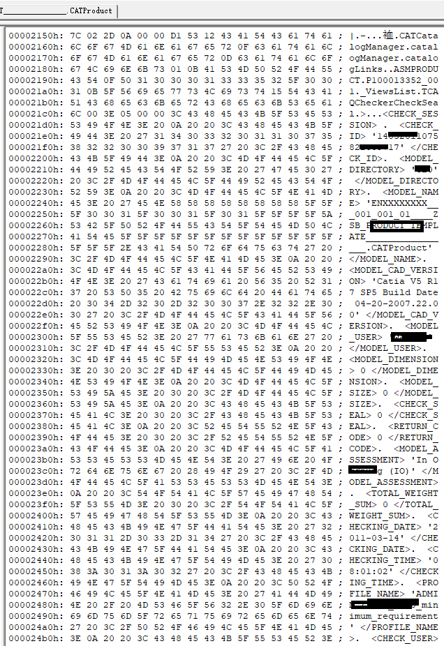
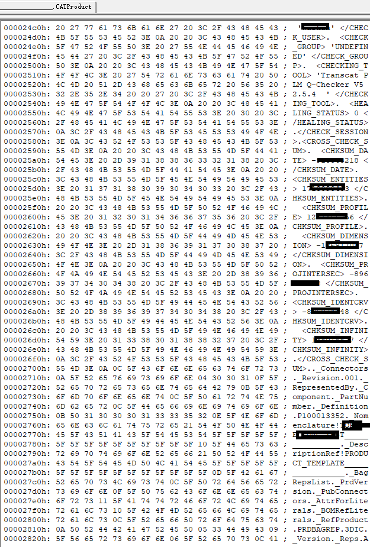
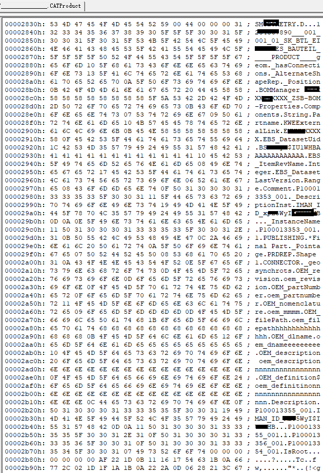
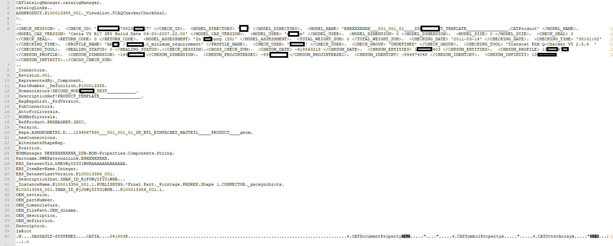

## RedefineCAD-04: Deep Dive into CATIA Dump Protocol

> 🧩 **Background Note:**\
> This article is the formal continuation of an experimental story initially documented in our [SideStory: From CATIA Dump to Structured Blocks](./redefine_cad_side_story_dump_protocol.md).
>
> That side story explored the *real-world frustration* of facing undocumented `.CATProduct` binary files and discovering structure within their dump representations. While SideStory captured the moment of "desperate insight," this article focuses on the formal methodology, tokenization, and parsing architecture developed to process such dumps using a domain-specific language (DSL).

---

### 🌟 Objective

This article presents a structured deep dive into the `.CATProduct` dump protocol from CATIA, examining how RedefineCAD extracts and interprets structure from these opaque binary representations. We propose a formal tokenization strategy and a recursive-descent parser to reconstruct the logical hierarchy of CAD data.

### 📦 From Binary to Blocks

`.CATProduct` is a proprietary binary file format used by CATIA to store assemblies. It is not officially documented. However, CATIA provides mechanisms to dump these files into partial plaintext representations—typically through debug-level API hooks or internal utilities.

Here is an example of the transformation path:



*Figure 1 – The dump begins with system-level metadata lines, densely packed and difficult to read without processing.*



*Figure 2 – As we move further, nested tag structures and repeating patterns emerge, hinting at hierarchy.*



*Figure 3 – Deeper into the file, labels, tag/value pairs, and structural markers mix together.*



*Figure 4 – After manual tokenization, the content is structured and clean, making it ready for parser input.*

These images illustrate the journey from raw, dense text to a cleanly tokenized structure.

### 🧩 Structure in the Chaos

The dump format exhibits patterns:

- **System Attributes:** Denoted as `<TAG> 'value'</TAG>`, like `<CHECK_ID> '123456789' </CHECK_ID>`
- **Structural Labels:** Prefixed with underscores, such as `_ViewsList`, `_DescriptionInst`, `_InstanceName`
- **Property Paths:** Dot-separated, often recursive, e.g., `ASMPRODUCT.P100013352_001._ViewsList`

These fragments reveal hierarchical intent, but without a formal grammar, parsing is brittle.

### 🛠️ The Tokenization Process

We define a custom tokenizer using regular expressions that emit tokens such as:

- `TAG_OPEN`, `TAG_CLOSE`
- `STRING`, `QUOTED_VALUE`, `LABEL`, `DOT`, `NEWLINE`

The lexer is designed to handle ambiguity (e.g., when `<CHECK_ID>` is followed by a line break or omitted closing tag) and normalize malformed patterns.

### 🧱 Parsing the Dump: DSL in Action

A domain-specific language (DSL) is used to formally express expected structures. For example:

```dsl
_ViewsList {
  <CHECK_SESSION> '...'</CHECK_SESSION>
  <MODEL_NAME> '...'</MODEL_NAME>
}
```

We implement a recursive descent parser that emits:

- **AST (Abstract Syntax Tree)**
- **Structured JSON output**
- **Human-readable diagnostics**

#### 📐 Parser Architecture and Strategy

Our parser adopts a recursive-descent strategy: each DSL rule is implemented as a dedicated method (e.g., `parse_views_list()`), which calls sub-rules recursively. The parser delegates AST node creation to a configurable factory, supporting both JSON and tuple-style outputs. This architecture allows partial parsing and graceful recovery from malformed blocks.

#### 🔄 Extending Grammar with Tag-Aware Handlers

The parser supports grammar extensibility by registering new block patterns via a tag-prefix strategy. For example, `_InstanceName` and `_DescriptionInst` blocks are parsed by dynamically dispatched handlers, allowing flexible adaptation to evolving `.CATProduct` formats.

### 🔐 Why It Matters

The CATIA dump protocol is not secure. Although the binary format is proprietary, once dumped, it exposes internal structures and metadata. This highlights the risks of assuming binary equals secure.

RedefineCAD offers a structured, declarative way to reconstruct the logical layout of `.CATProduct` dumps, paving the way for further automation, auditing, and conversion.

### 📌 Appendix: Reference Images

- `1.png`: Magic header bytes (file signature)
- `2.png`: Possible version/format indicators
- `3.png`, `4.png`, `5.png`: Raw text dumps (parsing targets)
- `9.png`: Hand-tokenized structure
- `11.png`: Visual view of root assembly in CATIA
- `12.png`: Root node properties panel
- `13.png`: First-level part properties
- `14.png`: First-level sub-assembly properties
- `15.png`, `16.png`: Second-level part properties

📌 *Note:* The DSL methodology described here follows the architectural pattern established in our MMSA whitepaper (see Chapter 2). This includes block-based reasoning, partial parsing, and deferred resolution.

📌 *Disclaimer:* This analysis is for educational purposes only. The `.CATProduct` format remains proprietary to Dassault Systèmes. We do not claim to reverse-engineer, emulate, or replicate CATIA's internals.

---

### 🟢 Next Up

**RedefineCAD-05: From Structure to Query** (Coming Soon)

