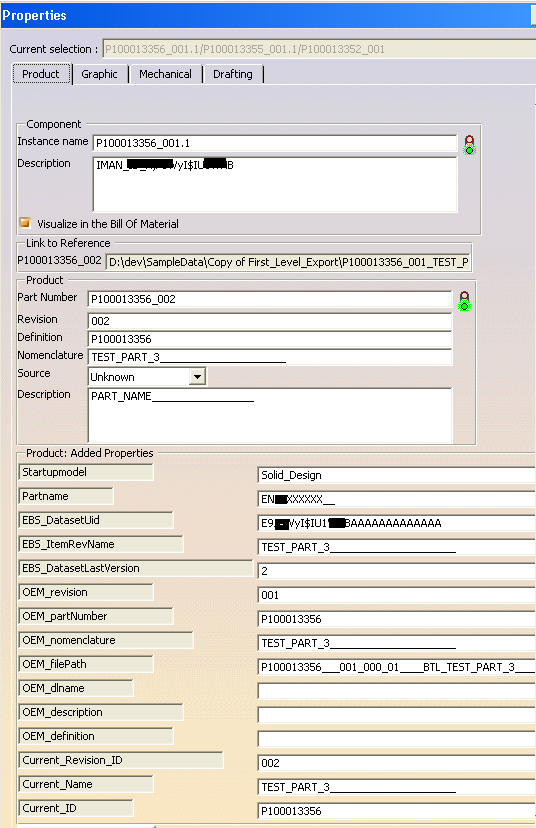
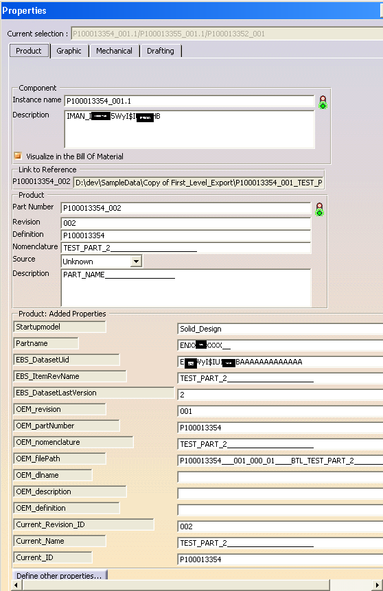

## RedefineCAD SideStory: From CATIA Dump to Structured Blocks

### Introduction

While MMSA outlines a universal block-based architecture, this side story dives into the very soil from which RedefineCAD’s structure-aware model grew: the raw, undocumented, and often terrifyingly messy `.CATProduct` dump files. This document serves as both a narrative and a technical dissection—how we deconstructed legacy CAD data and rebuilt it into verifiable semantic blocks.

These `.CATProduct` files are binary by nature. However, they can be exported as human-readable (though still obscure) text dumps using internal inspection features or developer utilities, and then interpreted externally. Below is an excerpt from such a dump:

```
ÑS.CATCatalogManager.catalogManager.catalogLinks..ASMPRODUCT.P100013352_001._ViewsList.TCAQCheckerCheckSeal.>...<CHECK_SESSION> .  <CHECK_ID> '14032011075822009717'
```

To make sense of these raw fragments, we first **tokenized** them by hand, aiming to extract and structure the key metadata relationships buried within. The process involved interpreting elements such as:

- `3.png`, `4.png`, and `5.png`: raw token highlights, tuple formats, and AST renderings
- `9.png`: our **manual tokenization goal**—the target format for downstream structuring

This document focuses on that journey of interpreting CATIA dump files—turning them from indecipherable text into semantically meaningful blocks.

> **Note on Scope and Ethics**
>
> The `.CATProduct` format is a proprietary binary structure developed by Dassault Systèmes. Our goal is not to decode or reverse-engineer the binary layout directly, but to propose a reproducible **methodology** for analyzing exported text-based representations, such as CATIA dump files.
>
> All parsing and DSL tooling described herein operates solely on **textual exports** produced via official or internal inspection tools. This document serves as an intellectual exploration of metadata recovery and structure recognition—not as a circumvention of proprietary protections.

> ### ⚠ Version Note
>
> The `.CATProduct` dump structure varies across CATIA versions.\
> All examples and dump patterns in this document are based on **CATIA V5 R19 (Build 10-09-2009.22.00)**.\
> We recommend validating compatibility with your own CATIA installation before applying the same DSL tokenization rules.\
> Future RedefineCAD releases may support pattern profiles for additional CATIA versions.

### ⚖ Disclaimer

This document does not attempt to reverse-engineer or decrypt the proprietary binary layout of `.CATProduct` files. All analyses are based solely on textual exports that are accessible via legitimate inspection workflows.\
RedefineCAD operates on these **already-exposed representations** to offer a reproducible methodology for metadata recovery and structural reasoning.

We fully acknowledge that `.CATProduct` and related formats are intellectual property of Dassault Systèmes. Our goal is to improve interpretability and lifecycle visibility—not to circumvent protections.\
If you are building or distributing tools based on this article, ensure compliance with software licenses and applicable regulations in your jurisdiction.

> ### ✴ Why We Started: Motivation from the Dump
>
> This work was born from the frustrations of trying to make sense of undocumented `.CATProduct` dumps—files filled with opaque identifiers, loose syntax, and zero structure. Despite being exported from industry-standard software, the data lacked *interpretability*. And that's dangerous.
>
> It highlighted a systemic flaw: **industrial CAD files are not truly self-descriptive**. Worse, they are often used as both design carriers and metadata authorities—without offering semantic guarantees.
>
> RedefineCAD was not created to decode CATIA. It was built to **redefine the data contract** between CAD systems and downstream consumers. By converting legacy dumps into structured blocks, we reclaim control, visibility, and trust in our design pipeline.
>
> This SideStory represents the seed of that revolution.

---

### 1. The Dump Format: A Strange Wilderness

CATIA V5 `.CATProduct` files, when exported in internal form (via undocumented debug tools or inspection scripts), produce a loosely structured dump with lines like:

```
ÑS.CATCatalogManager.catalogManager.catalogLinks..ASMPRODUCT.P100013352_001._ViewsList.TCAQCheckerCheckSeal.>...<CHECK_SESSION> .  <CHECK_ID> '14032011075822009717'
```

This is not XML. Nor JSON. Nor Lisp. Nor anything your parser will love.

Yet these lines represent *real relationships*—between geometry parts, revisions, views, checks, and lifecycle states.

In the real world, when you receive a `.CATProduct` or `.CATPart`, you can often inspect it using a compatible version of CATIA. These tools display geometry and properties via the desktop GUI, or extract metadata using VBScript, PyCATIA, or `win32com`. But this accessibility should not be mistaken for security: **the data structure is not encrypted or protected by design**. In high-security sectors like aerospace, this lack of protocol hardening poses serious risks.

That’s one of the reasons RedefineCAD exists—not to decode CATIA, but to advocate for safe, verifiable, and extensible structure definitions.

To demonstrate our methodology, we started by manually tokenizing dump segments, illustrated in the following figures:

- `3.png`, `4.png`, and `5.png` showcase the raw dump, tokenization highlights, and abstract syntax tree
- `9.png` represents the manual tokenization outcome, which serves as a ground truth for our DSL

These were obtained from dumps of real-world CATIA files and represent our target structure for parsing and block assembly.

---

### 2. DSL by Necessity, Not Luxury

We designed a Domain-Specific Language (DSL) to tokenize, tag, and eventually transform this dump into structured graph blocks. This DSL is not meant for humans to write—but for *machines to read and reason about*.

Key DSL Goals:

- Robust against inconsistent indentation and malformed tags
- Recoverable context from inline position and attribute grouping
- Tag pairs, attribute-value pairs, block hints all treated as first-class

Example fragment:

```text
<MODEL_NAME> 'ENXXXXXXXX___001'
<TREE_PATH> 'P123456/P100002/P200003'
*Final Part
```

From this, we extract:

- `MODEL_NAME` → block identifier
- `TREE_PATH` → structural lineage
- `*Final Part` → semantic role

---

### 3. Tokenization: Reclaiming Order from Chaos

We wrote a custom Tokenizer capable of recognizing:

- String literals
- System attributes like `<CHECK_ID>`, `<MODEL_NAME>`
- Hierarchical tags (e.g., `_ViewsList`, `_DescriptionInst`)
- Control characters: `.`, `>`, `*`

And even more critically, whitespace and newline behaviors are *interpreted*, not ignored.

---

### 4. Parsing for Structure

The Parser builds a loose AST (abstract syntax tree), then folds it into a block-compatible JSON or tuple format. Each parsed entry preserves enough traceability to:

- Reconstruct block dependency graph
- Build semantic blocks (identity, geometry, meta, lineage)
- Support rollback or re-tokenization

Diagram:\


To understand the metadata payload we are targeting, here are real-world CATIA property panels:

CATIA Property Panel Sample 1: 

  \

CATIA Property Panel Sample 2: 



These screenshots show the structured metadata blocks (e.g., Part Number, Definition, OEM\_ fields) that our DSL will extract and reconstitute into atomic CAD blocks.

---

### 5. Why This Matters

This is not just a parsing task. It’s a political act: **liberating data from locked systems**.

By bridging legacy formats with new semantic foundations, RedefineCAD doesn't just store geometry—it understands it.

---

### 6. Coming Up Next

In RedefineCAD-04, we’ll go from parsed tuples to structured geometry blocks. We’ll define:

- Block categories
- Dependency edges
- View synthesis
- Integrity checkpoints

> 👉 Stay tuned for **RedefineCAD-04: Structured Geometry from Industrial Dumps**

---

### Appendix: Reference Images

The following supplemental figures are referenced throughout this article and may be useful for readers wishing to understand the full scope of the DSL tokenization and structure mapping:

| ID | Filename | Description                                           |
| -- | -------- | ----------------------------------------------------- |
| 1  | `1.png`  | CATIA magic header (hex signature of binary)          |
| 2  | `2.png`  | Version and header fields (tentatively identified)    |
| 3  | `3.png`  | Raw dump excerpt (tokenization target)                |
| 4  | `4.png`  | Highlighted token pattern                             |
| 5  | `5.png`  | AST diagram showing parsed structure                  |
| 6  | `9.png`  | Manually tokenized stream—serves as DSL parser target |
| 7  | `11.png` | CATIA UI showing root-level assembly                  |
| 8  | `12.png` | Property panel for root node                          |
| 9  | `13.png` | Property panel for level-1 part                       |
| 10 | `14.png` | Property panel for level-1 sub-assembly               |
| 11 | `15.png` | Property panel for level-2 sub-part (variant A)       |
| 12 | `16.png` | Property panel for level-2 sub-part (variant B)       |

📁 All images can be found in the project root directory under `/assets/`.

---

### 📎 Footnote

For a comprehensive introduction to the **Modular Metadata Structure Architecture (MMSA)** that underpins the ideas in this article, please refer to our companion white paper:\


**“MMSA: A Modular Architecture for Structured Engineering Data”**

This white paper outlines the theoretical framework behind RedefineCAD’s block-based model and provides practical examples, extensibility patterns, and cross-domain applications.

---

### 🛡️ Final Note on Ethics and Security

This work was conducted purely as an academic and engineering investigation. We are not affiliated with Dassault Systèmes, nor do we claim any authority over `.CATProduct` internals. Our goal is to demonstrate that even closed systems can benefit from structure-oriented thinking—and that we can rebuild trust and transparency without needing source code or proprietary APIs.

No part of this work should be used to bypass license restrictions, export controls, or contractual agreements. When in doubt, consult your legal advisor.

